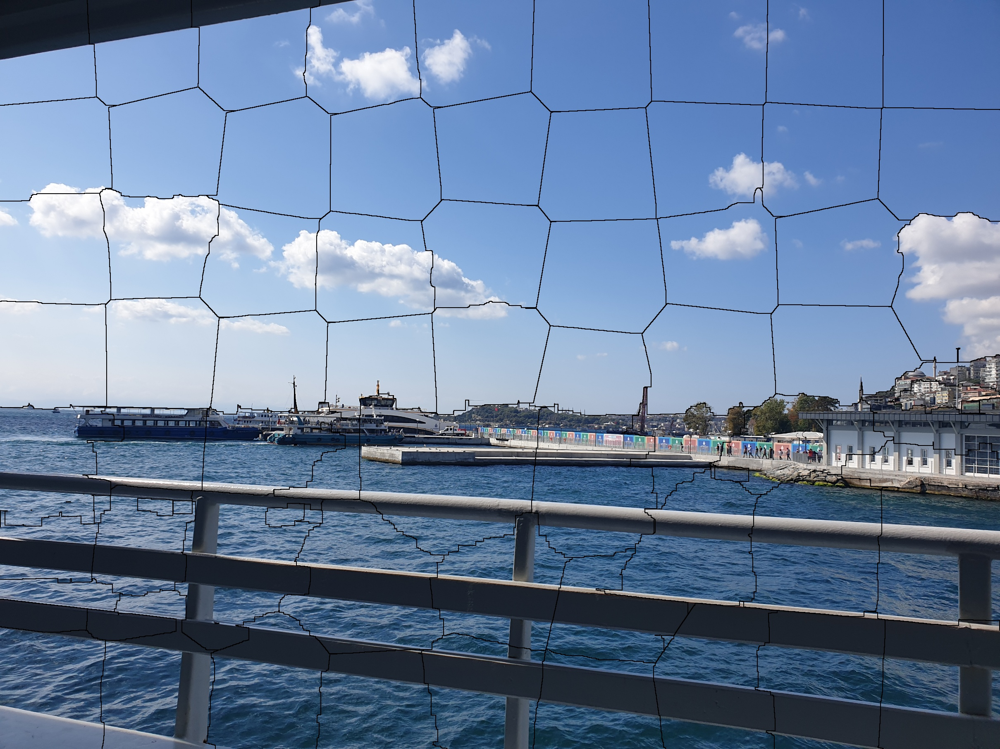
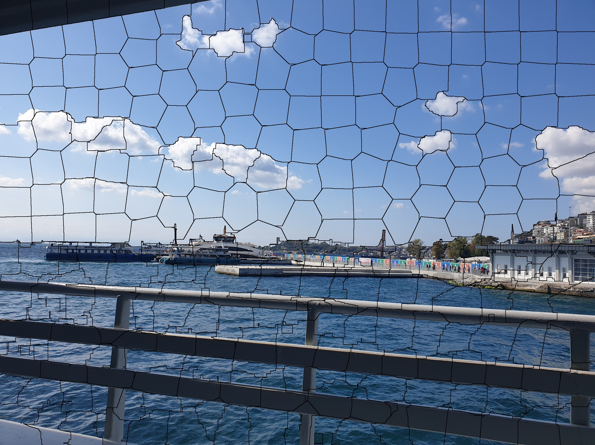
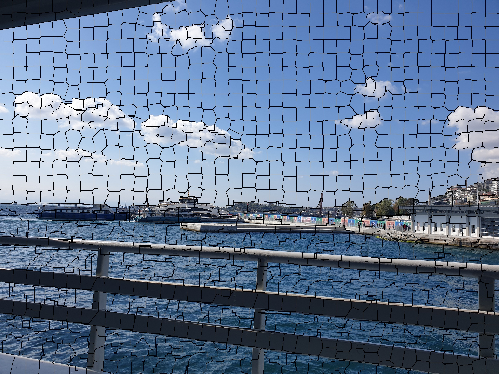
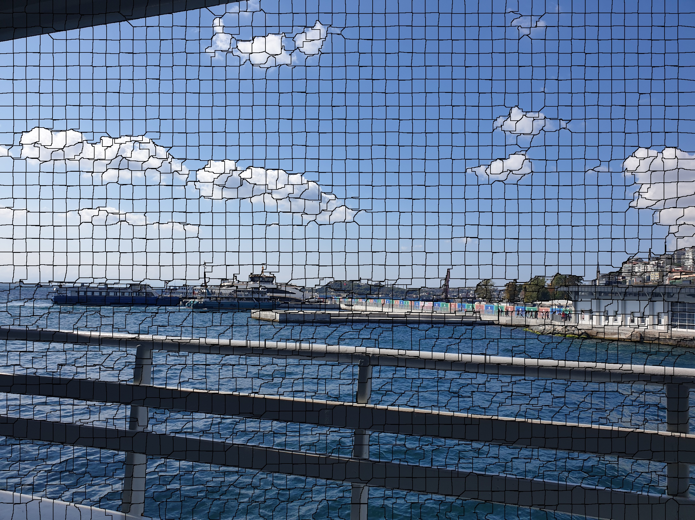

## Using the SLIC superpixel segmentation method, I divide org_img into 64, 256, 1024 and 2048 superpixel segments.
#
## original image:

#
## result images:

<b>64 segment image</b>

 

<b>256 segment image</b>

 

<b>1024 segment image</b>

 

<b>2048 segment image</b>

 
